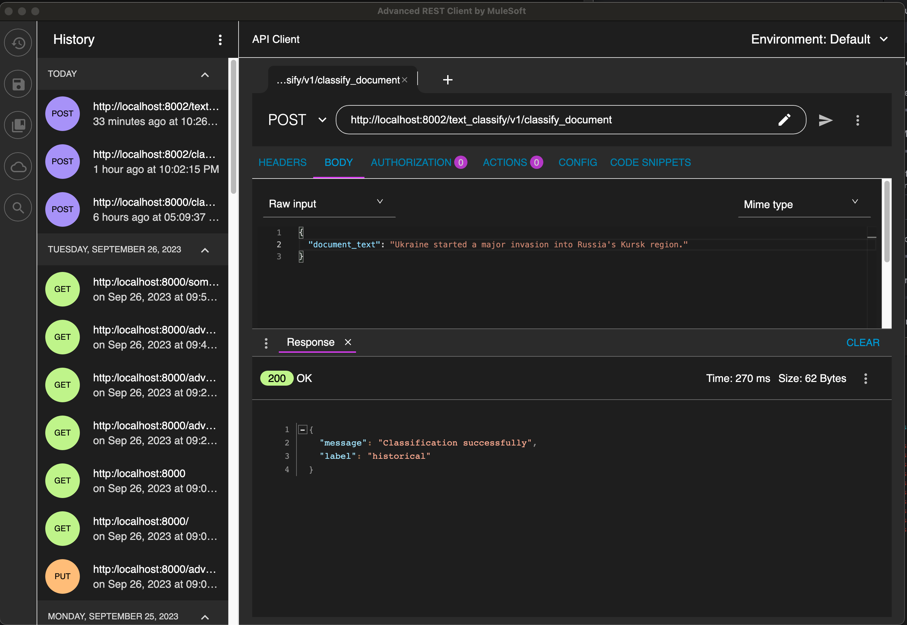
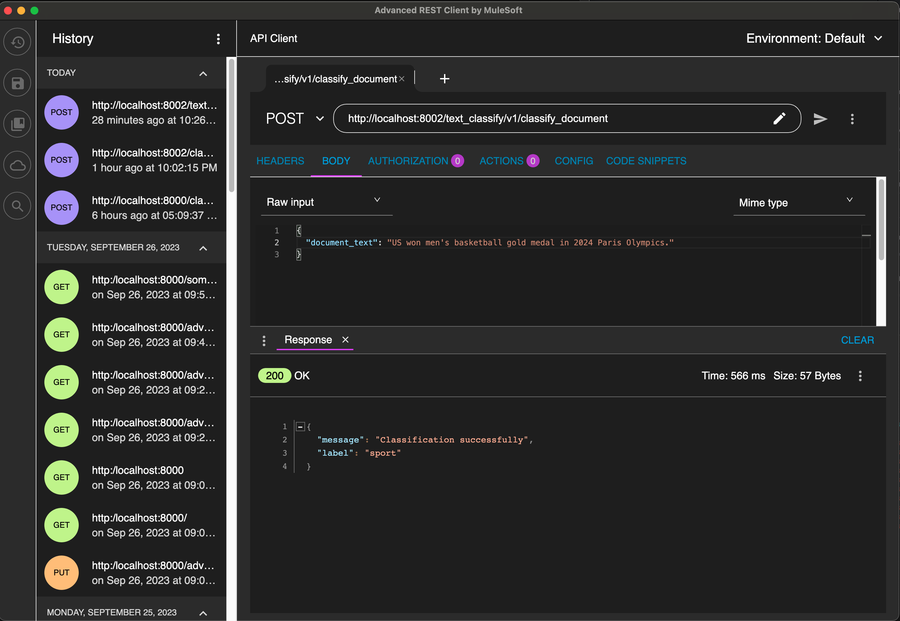
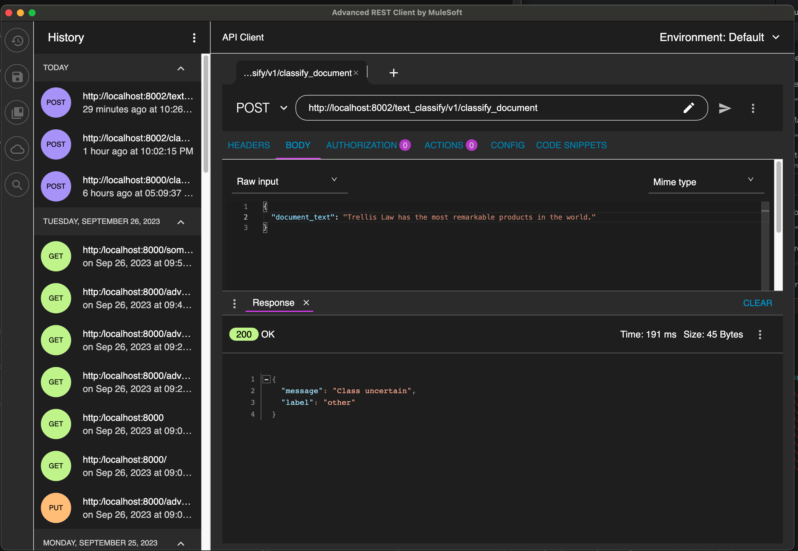

# Text Classifier Exercise

## Directory Structure

- *src/main*: Source code
  - *classifier*: Classifier classes
  - *training*: Main programs for training and playground for inference
  - *api*: REST API server
- *src/test*: Unit test code
- *notebooks*: Jupyter notebooks for demos and experiments
- *deployment*: Scripts for deployment
- *data*: Contains test data

## Development Plan/Status

### Items Done

- Generic classifier works (trainable, inferable)
- Generic classifier save/load
- Embedding objects
- Text classifier extends from the generic classifier
- Main programs for training and inference pipelines
- REST API
- Deployment scripts and Dockerfile

### In Progress

- Comments and user guides

### To-Dos

- None so far

### Screenshots

"Ukraine started a major invasion into Russia's Kursk region" was classified as "historical".

"US won men's basketball gold medal in 2024 Paris Olympics" was classified as "sport".

"Trellis Law has the most remarkable products in the world" has low confidence in classification, so it is "other". 

