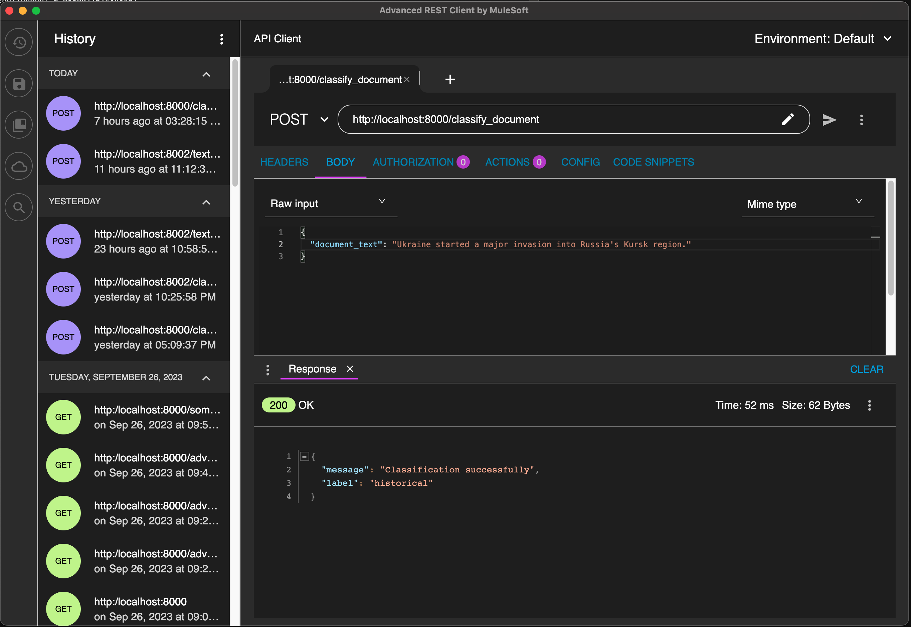

# Text Classifier Exercise


## Directory Structure

- *src/main*: Source code
  - *classifier*: Classifier classes
    - `ForwardNN.py`: A generic feed forward neural network
    - `NNClassifier.py`: A generic classifier built around `ForwardNN`
    - `TextClassifier.py`: A text classifier built around `NNClassifier`
  - *embedding*: Text embedding classes
    - `Embedding.py`: An abstract class for text embedding models
    - `TransformersEmbedding.py`: A concrete subclass of `Embedding` using the HuggingFace interface.
    - `AdaEmbedding.py`: (not yet implemented) A concrete subclass of `Embedding` using the OpenAI interface.
  - *training*: Main programs for training pipeline and playground for inference
  - *api*: REST API server
- *src/test*: Unit test codes
- *notebooks*: Jupyter notebooks for demos and experiments
- *deployment*: Scripts for deployment
- *data*: Contains training data, unit tests data and outputs, trained classifier models.
  (Training dataset are not checked in to this public GitHub.)

## User Guides

### Overview

The system consists of three primary programs, each serving a distinct purpose:

1. **Model Training**: The `do_training.py` script is to train the classification model from the labeled data.

2. **Interactive Classification**: The `go_playing.py` script allows users to interactively input text and receive instant classification results.

3. **API Server**: The `start_api.py` script launches an API server, making it possible to integrate the classifier into other applications or systems.
This server provides an endpoint for external applications to send text data for classification.

All three Python scripts can be found in the **deployment** directory and can be executed from there.

In addition to running the Python scripts directly, you have the option to operate the API server using Docker.
This can be accomplished by building and running a Docker image from the top-level project directory, where the Dockerfile is located. For your convenience, the project includes `build_docker.sh` and `run_docker.sh` scripts to streamline this process.

#### Configuration

Parameters for the text classifier can be modified in the `config.properties` file located in the deployment directory. If you wish to use a different configuration file, you can specify it with the `-c <config_file_name>` option when executing any of the three Python scripts.

Furthermore, the configurations of the three Python scripts can also be overridden using command line options.  Use `-h` for a help of the options.

Detailed descriptions of the configurable parameters are as follows:

**Properties applied to all scripts**

These are listed under the `[DEFAULT]` section of the property file.  
They can be overridden by script specific sections.

|  config.properties key | CLI options | Default | Description         |
|-------------|------------|---------|---------------------|
| model     | --model    | *(mandatory)* |Path to the classifier model |

**Properties for do_training**

These are listed under the `[TRAIN]` section of the property file.
The properties in the `[DEFAULT]` can also be overridden here.

| config.properties key | CLI options | Default       | Description                                               |
|-----------------------|-------------|---------------|-----------------------------------------------------------|
| data                  | --data      | *(mandatory)* | Path to dataset for training                              |
| embedding | --embedding | 'bert' | What pretrained embedding model to use                    |
| confidence | --confidence | 0.9 | The threshold under which the classification is uncertain |
| other | --other | 'other' | What label to use if the classification certainty is weak |

**Properties for go_playing**

These are listed under the `[PLAY]` section of the property file.
The properties in the `[DEFAULT]` can also be overridden here.

No script specific properties at the moment.

**Properties for start_api**

These are listed under the `[API]` section of the property file.
The properties in the `[DEFAULT]` can also be overridden here.

| config.properties key | CLI options | Default | Description     |
|-----------------------|-------------|---------|-----------------|
| port                  | --port      | 8000    | API server port |
| root | --root | '' | Base path of the endpoints |

## Execution Examples

Here are a few examples running the codes.

One can find a default config file [`config.properties`](deployment/config.properties) in the *deployment* directory.
If no arguments are specified, the scripts take its configuration from there.

When in doubt, use `-h`, as follows:

```
(base) [21:56:13] cjwang@MacBook-Pro deployment % python3.11 do_training.py -h
usage: do_training.py [-h] [-c CONFIG] [--data DATA] [--model MODEL] [--embedding EMBEDDING] [--confidence CONFIDENCE] [--other OTHER] [-v]

Train a text classifier.

options:
  -h, --help            show this help message and exit
  -c CONFIG, --config CONFIG
                        Configura (default: 'config.properties').
  --data DATA           Path to the directory containing training dataset.
  --model MODEL         Path to the directory to output the trained model.
  --embedding EMBEDDING
                        Text embedding model to use. (default: 'bert'.
  --confidence CONFIDENCE
                        Confidence threshold when inferring with the model
  --other OTHER         What to label a low-confidence classification
  -v, --verbose         Enable verbose output

```

This is an example running training with verbose output.

```
(base) [22:00:36] cjwang@MacBook-Pro deployment % python3.11 do_training.py -v
Start training with:
   - data set from ../data/training
   - embedding model 'bert'
   - unclassified label 'other'
   - confidence level 0.9
   - output model to ../data/testing/model
INFO:TextClassifier:Embedding the training set...
100%|███████████████████████████████████████████████████████████████████████████████████████| 40/40 [01:01<00:00,  1.55s/it]
INFO:TextClassifier:Embedding the validation set...
100%|███████████████████████████████████████████████████████████████████████████████████████| 10/10 [00:15<00:00,  1.55s/it]
INFO:NNClassifier:Epoch [1/60], Loss: 1.9556
INFO:NNClassifier:Validation Loss: 1.3151
INFO:NNClassifier:Epoch [2/60], Loss: 0.7862
INFO:NNClassifier:Validation Loss: 0.4364
INFO:NNClassifier:Epoch [3/60], Loss: 0.2820
INFO:NNClassifier:Validation Loss: 0.1867
INFO:NNClassifier:Epoch [4/60], Loss: 0.1596
INFO:NNClassifier:Validation Loss: 0.1409
INFO:NNClassifier:Epoch [5/60], Loss: 0.0884
INFO:NNClassifier:Validation Loss: 0.1067
INFO:NNClassifier:Epoch [6/60], Loss: 0.0616
INFO:NNClassifier:Validation Loss: 0.1048
INFO:NNClassifier:Epoch [7/60], Loss: 0.0447
INFO:NNClassifier:Validation Loss: 0.0881
INFO:NNClassifier:Epoch [8/60], Loss: 0.0317
INFO:NNClassifier:Validation Loss: 0.0813
INFO:NNClassifier:Epoch [9/60], Loss: 0.0252
INFO:NNClassifier:Validation Loss: 0.0707
INFO:NNClassifier:Epoch [10/60], Loss: 0.0195
INFO:NNClassifier:Validation Loss: 0.0669
INFO:NNClassifier:Epoch [11/60], Loss: 0.0149
INFO:NNClassifier:Validation Loss: 0.0692
INFO:NNClassifier:Epoch [12/60], Loss: 0.0112
INFO:NNClassifier:Validation Loss: 0.0681
INFO:NNClassifier:Epoch [13/60], Loss: 0.0087
INFO:NNClassifier:Validation Loss: 0.0543
INFO:NNClassifier:Epoch [14/60], Loss: 0.0069
INFO:NNClassifier:Validation Loss: 0.0558
INFO:NNClassifier:Epoch [15/60], Loss: 0.0060
INFO:NNClassifier:Validation Loss: 0.0582
INFO:NNClassifier:Epoch [16/60], Loss: 0.0056
INFO:NNClassifier:Validation Loss: 0.0585
INFO:NNClassifier:Early stopping on epoch 16
(base) [22:02:09] cjwang@MacBook-Pro deployment % 

```

Once model is trained.  One can play with the `go_playing.py`.

```
(base) [22:02:53] cjwang@MacBook-Pro deployment % python3.11 go_playing.py 
Playground started with:
   - classifier model at ../data/model

Type or paste anything to classify.  Type 'q' to exist.
>> US won men's basketball gold medal in 2024 Paris Olympics.
It is sport (confidence: 0.9998722076416016)
>> Stocks plunged more than 150 points on 5th of August, 2024.
It is business (confidence: 0.988997757434845)
>> JWST has taken images of a cold exoplanet 12 light-years away.
It is space (confidence: 0.9996743202209473)
>> Trellis Law has the most remarkable products in the world.
It is other (confidence: 0.802179217338562)
>> q
Goodbye.
```

One can start the API server with `start_api.py` as below.

```
(base) [22:09:18] cjwang@MacBook-Pro deployment % python3.11 start_api.py -v
INFO:     Started server process [20334]
INFO:     Waiting for application startup.
INFO:     Application startup complete.
INFO:     Uvicorn running on http://0.0.0.0:8000 (Press CTRL+C to quit)
INFO:root:Receive request: Ukraine started a major invasion into Russia's Kursk region.
INFO:root:Classification: historical, Confidence: 0.925609290599823
INFO:     127.0.0.1:58694 - "POST /classify_document HTTP/1.1" 200 OK

```

Then use an API client to invoke the service.  See screenshot below.
Note that the API server was run with verbose mode, and one can see the request, response, and the confidence value shown on the log messages above.



One can deploy the server in a Docker image.
At the top level where the Dockerfile is, one can build a Docker image with `build_docker.sh` script.
It may take a long while the first time is is built.

```
(base) [22:29:42] cjwang@MacBook-Pro tl_classifier % ./build_docker.sh 
[+] Building 8.5s (13/13) FINISHED                                                                          docker:desktop-linux
 => [internal] load build definition from Dockerfile                                                                        0.0s
 => => transferring dockerfile: 699B                                                                                        0.0s
 => [internal] load .dockerignore                                                                                           0.0s
 => => transferring context: 2B                                                                                             0.0s
 => [internal] load metadata for docker.io/library/python:3.11-slim                                                         1.3s
 => [1/8] FROM docker.io/library/python:3.11-slim@sha256:ad5dadd957a398226996bc4846e522c39f2a77340b531b28aaab85b2d361210b   0.0s
 => [internal] load build context                                                                                           0.0s
 => => transferring context: 26.48kB                                                                                        0.0s
 => CACHED [2/8] WORKDIR /app                                                                                               0.0s
 => CACHED [3/8] COPY requirements.txt .                                                                                    0.0s
 => CACHED [4/8] RUN pip install --no-cache-dir -r requirements.txt                                                         0.0s
 => CACHED [5/8] COPY ./deployment /app/classifier/deployment                                                               0.0s
 => [6/8] COPY ./src /app/classifier/src                                                                                    0.0s
 => [7/8] WORKDIR /app/classifier/deployment                                                                                0.0s
 => [8/8] RUN python load_pretrained_models.py                                                                              6.7s
 => exporting to image                                                                                                      0.4s
 => => exporting layers                                                                                                     0.4s
 => => writing image sha256:3713871e4e3fb6587bacde17449e9b17e077fb884f1fe01ae86a738cda8b209a                                0.0s
 => => naming to docker.io/library/text_classifier_api                                                                      0.0s

What's Next?
  1. Sign in to your Docker account → docker login
  2. View a summary of image vulnerabilities and recommendations → docker scout quickview

```

Running the `run_docker.sh` starts the API server on Docker.

```
(base) [22:32:01] cjwang@MacBook-Pro tl_classifier % ./run_docker.sh 
INFO:     Started server process [1]
INFO:     Waiting for application startup.
INFO:     Application startup complete.
INFO:     Uvicorn running on http://0.0.0.0:8000 (Press CTRL+C to quit)
INFO:     192.168.65.1:54375 - "POST /classify_document HTTP/1.1" 200 OK

```

## Development Plan/Status

### Items Done

- Generic classifier works (trainable, inferable)
- Generic classifier save/load
- Embedding objects
- Text classifier extends from the generic classifier
- Main programs for training and inference pipelines
- REST API
- Deployment scripts and Dockerfile

### In Progress

- Comments and user guides

### To-Dos

- None so far

